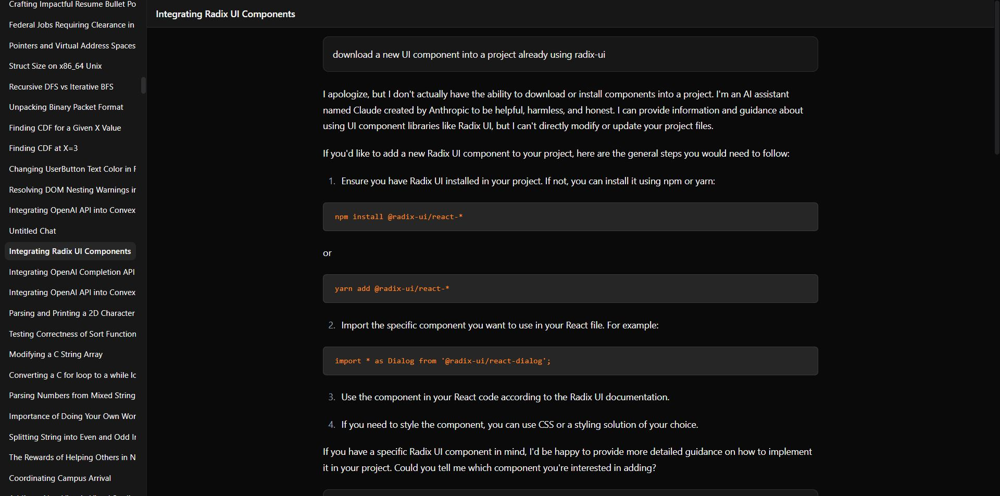

import { Card, CardGrid, LinkButton } from '@astrojs/starlight/components';

## What is Studio?

Airism Studio is a web application that transforms your AI conversation exports into an interactive, visual experience. Think of it as your personal AI conversation explorer—built for discovery, analysis, and insight.

## How Studio Complements Kit

While Kit provides the parsing foundation, Studio brings your data to life:

- **Kit** normalizes and structures your exports
- **Studio** visualizes and explores that structured data
- Together, they turn messy exports into actionable insights

## Core Features

### Timeline View of Conversations

<Card title="Visual Timeline" icon="star">
  See your AI interactions across time with an intuitive timeline interface. Spot patterns, identify productive periods, and track how your AI usage evolves.
</Card>

**Key Capabilities:**
- Chronological view of all conversations
- Zoom from years to individual days
- Visual indicators for conversation length and activity
- Filter by date ranges and AI platforms

### Search and Filter Across Sessions

<Card title="Powerful Search" icon="magnifier">
  Find any conversation, message, or topic across your entire AI history. Our search understands context, not just keywords.
</Card>

**Search Features:**
- Full-text search across all messages
- Filter by AI platform (ChatGPT, Claude, etc.)
- Date range filtering
- Message type filtering (user vs AI responses)
- Regex support for advanced patterns

### Tagging, Annotations, and Insights

<Card title="Organization Tools" icon="list-format">
  Add your own context to conversations with tags and notes. Build a personal knowledge base from your AI interactions.
</Card>

**Organization Features:**
- Custom tags for categorizing conversations
- Personal notes and annotations
- Auto-suggested tags based on content
- Bulk tagging operations
- Export tagged conversations

## Importing Your Data

### Drag-and-Drop Simplicity

Studio accepts multiple import methods:

<CardGrid>
  <Card title="Direct Upload" icon="upload">
    Drag ChatGPT `.json` files or Claude `.zip` exports directly into Studio
  </Card>
  <Card title="Kit Integration" icon="puzzle">
    Use Kit to pre-process and enhance your data before importing
  </Card>
</CardGrid>

### Supported Formats

- **ChatGPT**: `.json` exports from chat.openai.com
- **Claude**: `.zip` archives or individual conversation JSONs from claude.ai
- **Kit Output**: Enhanced JSON from Airism Kit processing

## FAQ

### Security and Privacy

**Q: Where is my data stored?**
A: Studio runs entirely in your browser by default. Your conversations never leave your device unless you explicitly choose cloud storage.

**Q: Can I use Studio offline?**
A: Yes! Studio works completely offline for local data analysis.

**Q: What about sensitive conversations?**
A: All processing happens locally. We never see your conversation content.

### Cloud vs Local

**Q: What's the difference between local and cloud modes?**

<CardGrid>
  <Card title="Local Mode (Default)" icon="laptop">
    - Data stays on your device
    - Works offline
    - No account required
    - Limited to browser storage
  </Card>
  <Card title="Cloud Mode (Optional)" icon="cloud">
    - Sync across devices
    - Unlimited storage
    - Team collaboration
    - Requires account
  </Card>
</CardGrid>

### Supported Formats

**Q: What AI platforms does Studio support?**
A: Currently ChatGPT and Claude, with more platforms coming soon. Our architecture makes adding new platforms straightforward.

**Q: Can I import partial exports?**
A: Yes! Studio handles partial exports, single conversations, or complete account histories.

**Q: What if my export format changes?**
A: We track export format changes and update our parsers automatically. Kit's modular design makes adaptation quick.

---

## Get Started with Studio

  <LinkButton href="https://studio.airism.dev" variant="primary">
    Launch Studio
  </LinkButton>
  <LinkButton href="/studio/chatgpt/" variant="secondary">
    ChatGPT Guide
  </LinkButton>
  <LinkButton href="/studio/claude/" variant="secondary">
    Claude Guide
  </LinkButton>

**Next Steps:**
- Try the [live demo](https://studio.airism.dev/demo) with sample data
- Read platform-specific guides: [ChatGPT](/studio/chatgpt/) or [Claude](/studio/claude/)
- Learn about [contributing to Airism](/welcome/05-contribute/)